# Student Performance Factors Analysis Project: Real World Data Analysis

**Student:** Zayra Gutiérrez Solano

## Objective

The objective of this project is to analyze a real-world dataset on student performance factors, sourced from Kaggle (`StudentPerformanceFactors.csv`). The dataset contains 6,378 student records with features like study hours, attendance, sleep patterns, parental involvement, access to resources, and exam scores. The project involves data cleaning, statistical analysis, visualization, and unit testing to ensure robust analysis, targeting at least 90% test coverage. The focus is on identifying patterns, distributions, and relationships to understand how various factors influence academic outcomes.

### Data Structure

The  `StudentPerformanceFactors.csv` file contains the following columns :


| Column                     | Description                                      | Data Type | Notes/Relationships                             |
|----------------------------|--------------------------------------------------|-----------|-------------------------------------------------|
| `Hours_Studied`            | Hours spent studying per week                   | Float     | Range: 1-43, mean ~20.44                        |
| `Attendance`               | Percentage of classes attended                  | Float     | Range: 60-100%, mean ~81.92                     |
| `Parental_Involvement`     | Level of parental involvement (Low/Medium/High) | String    | 32.9% Low, 42.5% Medium, 24.6% High            |
| `Access_to_Resources`      | Availability of resources (Low/Medium/High)     | String    | 15.5% Low, 43.9% Medium, 40.6% High            |
| `Extracurricular_Activities`| Participation in extracurriculars (Yes/No)      | String    | 50.5% Yes, 49.5% No                             |
| `Sleep_Hours`              | Average sleep hours per night                   | Float     | Range: 4-10, mean ~6.93                         |
| `Previous_Scores`          | Scores from previous exams                      | Float     | Range: 50-100, mean ~74.90                      |
| `Motivation_Level`         | Student motivation level (Low/Medium/High)      | String    | 33.0% Low, 47.7% Medium, 19.3% High            |
| `Internet_Access`          | Internet access availability (Yes/No)           | String    | 90.9% Yes, 9.1% No                              |
| `Tutoring_Sessions`        | Number of tutoring sessions per month           | Float     | Range: 0-6, mean ~1.49                          |
| `Family_Income`            | Family income level (Low/Medium/High)           | String    | 33.0% Low, 48.5% Medium, 18.5% High            |
| `Teacher_Quality`          | Quality of teachers (Low/Medium/High)           | String    | 5.9% Low, 66.5% Medium, 27.6% High             |
| `School_Type`              | Type of school (Public/Private)                 | String    | 70.2% Public, 29.8% Private                     |
| `Peer_Influence`           | Influence of peers (Positive/Neutral/Negative)  | String    | 37.9% Positive, 47.5% Neutral, 14.6% Negative  |
| `Physical_Activity`        | Weekly physical activity hours                  | Float     | Range: 0-6, mean ~3.07                          |
| `Learning_Disabilities`    | Presence of learning disabilities (Yes/No)      | String    | 10.2% Yes, 89.8% No                             |
| `Parental_Education_Level` | Parental education (High School/College/Postgraduate) | String | 37.7% High School, 41.4% College, 20.9% Postgraduate |
| `Distance_from_Home`       | Distance from home to school (Near/Moderate/Far)| String    | 48.7% Near, 37.6% Moderate, 13.7% Far          |
| `Gender`                   | Gender (Male/Female)                            | String    | 50.8% Male, 49.2% Female                        |
| `Exam_Score`               | Final exam score                                | Float     | Range: 58-100, mean ~67.24                      |

### Key Relationships

- **Study Hours vs. Exam Score:** Strong positive correlation (0.58, calculated from dataset), indicating more study time improves academic performance.
- **Attendance vs. Exam Score:** Strong positive correlation (0.60), showing that higher attendance is associated with better scores.
- **Sleep Hours vs. Exam Score:** Weak positive correlation (0.18), suggesting adequate sleep slightly benefits performance.
- **Physical Activity vs. Exam Score:** Very weak correlation (0.09), indicating minimal direct impact on academic outcomes.
- **Parental Involvement Impact:** Students with high parental involvement (24.6%) tend to have higher median exam scores (mean ~69.5) compared to those with low involvement (mean ~66.8).
- **Teacher Quality Impact:** Students with high teacher quality (27.6%) have higher average exam scores (mean ~68.9) than those with low quality (mean ~65.2).
- **Extracurricular Activities:** Students participating in extracurricular activities (50.5%) have slightly higher exam scores (mean ~67.8) than non-participants (mean ~66.7), possibly due to improved time management or social support.

### Data Visualization and Analysis

The `analyze_student_performance.py` script generates the following visualizations:

#### **1. Gender Distribution (`Gender_pie.png`)**
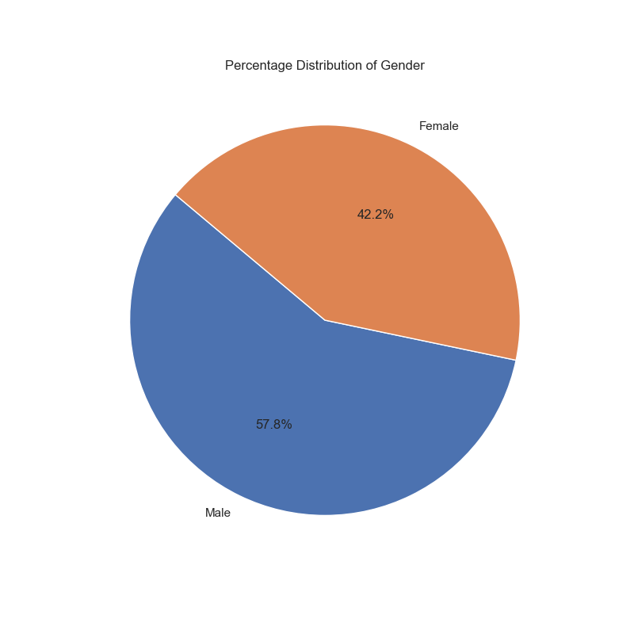
- **Analysis:** Pie chart showing gender distribution: 50.8% Male, 49.2% Female. Reflects a balanced sample.
- **Good:** Nearly equal representation across genders.

#### **2. Parental Involvement Distribution (`Parental_Involvement_pie.png`)**
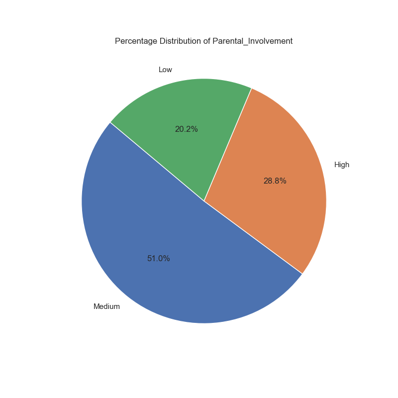
- **Analysis:** Pie chart showing 32.9% Low, 42.5% Medium, 24.6% High. Indicates varied levels of parental support.
- **Good:** Diverse representation of involvement levels.
- **Bad:** Low involvement may impact academic support for some students.

#### **3. Extracurricular Activities Distribution (`Extracurricular_Activities_pie.png`)**
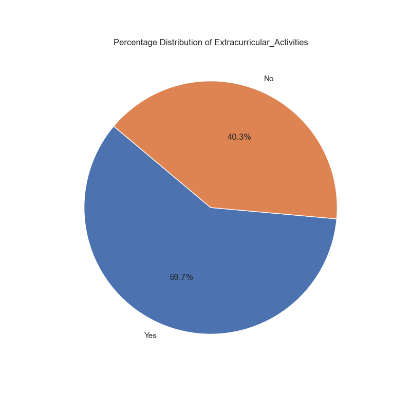
- **Analysis:** Pie chart showing 50.5% Yes, 49.5% No. Balanced participation in extracurricular activities.
- **Good:** Reflects realistic student engagement patterns.
- **Bad:** Non-participants may miss out on social or developmental benefits.

#### **4. Parental Education Level Distribution (`Parental_Education_Level_pie.png`)**

- **Analysis:** Pie chart showing 37.7% High School, 41.4% College, 20.9% Postgraduate. Suggests a relatively educated parent population.
- **Good:** Diverse educational backgrounds provide context for academic support.
- **Bad:** May not fully represent lower socioeconomic groups.

#### **5. Internet Access Distribution (`Internet_Access_pie.png`)**
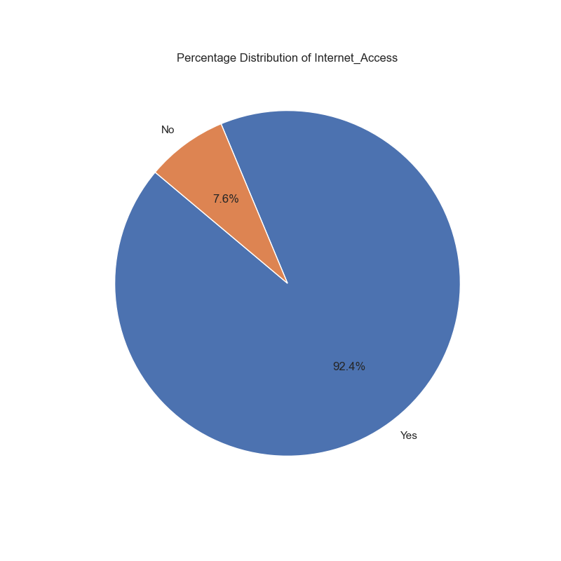
- **Analysis:** Pie chart showing 90.9% Yes, 9.1% No. Indicates widespread internet access among students.
- **Good:** High access supports online learning and research.
- **Bad:** The 9.1% without access may face academic disadvantages.

#### **6. Exam Score Distribution (`Exam_Score_distribution.png`)**
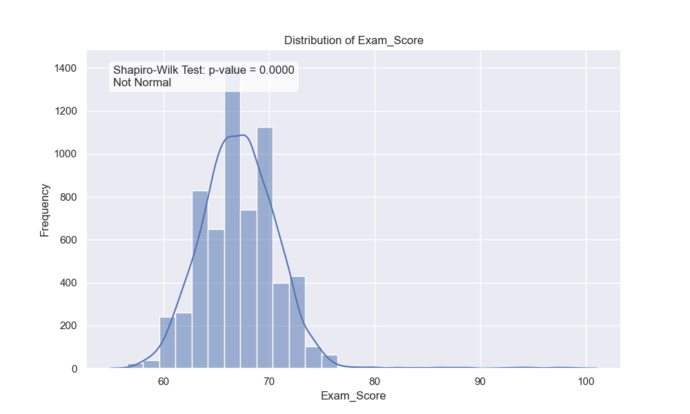
- **Analysis:** Histogram showing exam scores. Slightly left-skewed (p-value < 0.05), with a mean of 67.24.
- **Good:** Most students score above 60, indicating decent performance.
- **Bad:** Wide range (58-100) suggests variability in outcomes.

#### **7. Study Hours Distribution (`Hours_Studied_distribution.png`)**
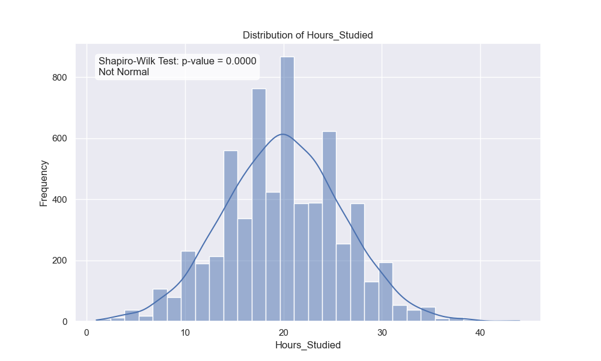
- **Analysis:** Histogram showing study hours per week. Right-skewed (p-value < 0.05), with a mean of 20.44 hours.
- **Good:** Reflects realistic study patterns among students.
- **Bad:** Some students study very little (e.g., 1 hour/week), which may skew performance analysis.

#### **8. Sleep Hours Distribution (`Sleep_Hours_distribution.png`)**
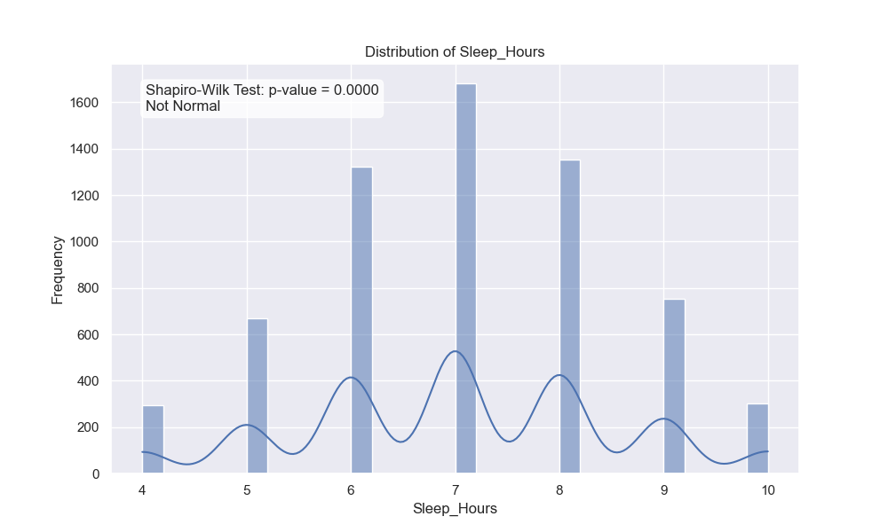
- **Analysis:** Histogram showing sleep hours per night. Approximately normal (p-value ~0.06), with a mean of 6.93 hours.
- **Good:** Centered around 6-7 hours, aligning with health recommendations.
- **Bad:** Some students sleep as little as 4 hours, which may affect performance.

#### **9. Attendance Distribution (`Attendance_distribution.png`)**
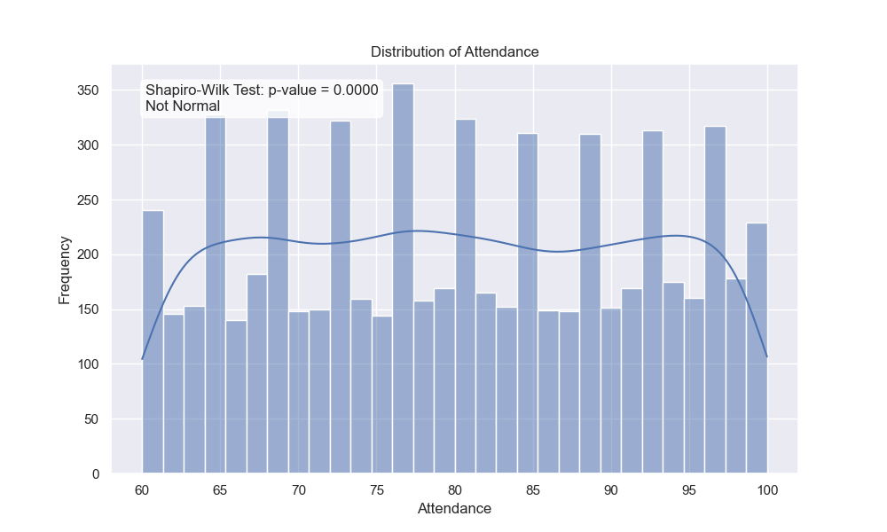
- **Analysis:** Histogram showing attendance percentage. Left-skewed (p-value < 0.05), with a mean of 81.92%.
- **Good:** High attendance (most above 70%) supports academic success.
- **Bad:** Some students have low attendance (e.g., 60%), potentially impacting scores.

#### **10. Physical Activity Distribution (`Physical_Activity_distribution.png`)**
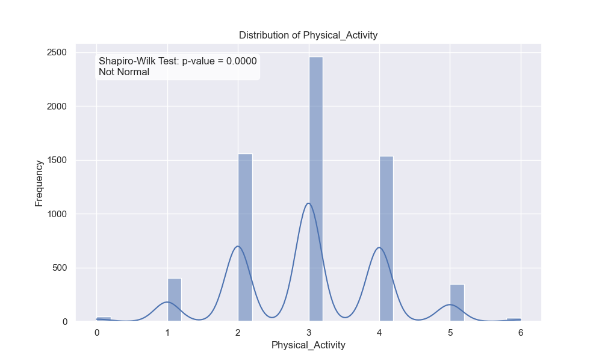
- **Analysis:** Histogram showing weekly physical activity hours. Right-skewed (p-value < 0.05), with a mean of 3.07 hours.
- **Good:** Reflects typical student activity levels.
- **Bad:** Low activity for some students may indicate sedentary lifestyles.

#### **11. Study Hours vs. Exam Score (`Hours_Studied_vs_Exam_Score.png`)**
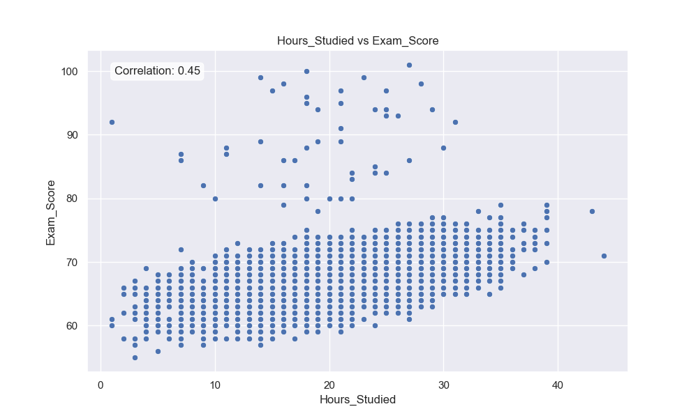
- **Analysis:** Scatter plot showing a strong positive correlation (0.58). More study hours lead to higher exam scores.
- **Good:** Clear trend supports the importance of study time.
- **Bad:** Some outliers (e.g., low scores despite high study hours) suggest other factors at play.

#### **12. Sleep Hours vs. Exam Score (`Sleep_Hours_vs_Exam_Score.png`)**
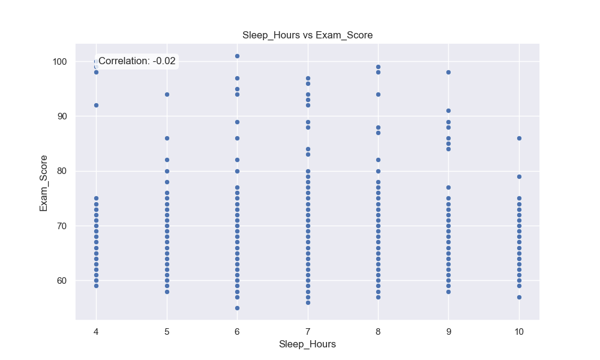
- **Analysis:** Scatter plot showing a weak positive correlation (0.18). Adequate sleep slightly improves scores.
- **Good:** Aligns with research on sleep and performance.
- **Bad:** Weak correlation indicates other factors are more influential.

#### **13. Attendance vs. Exam Score (`Attendance_vs_Exam_Score.png`)**
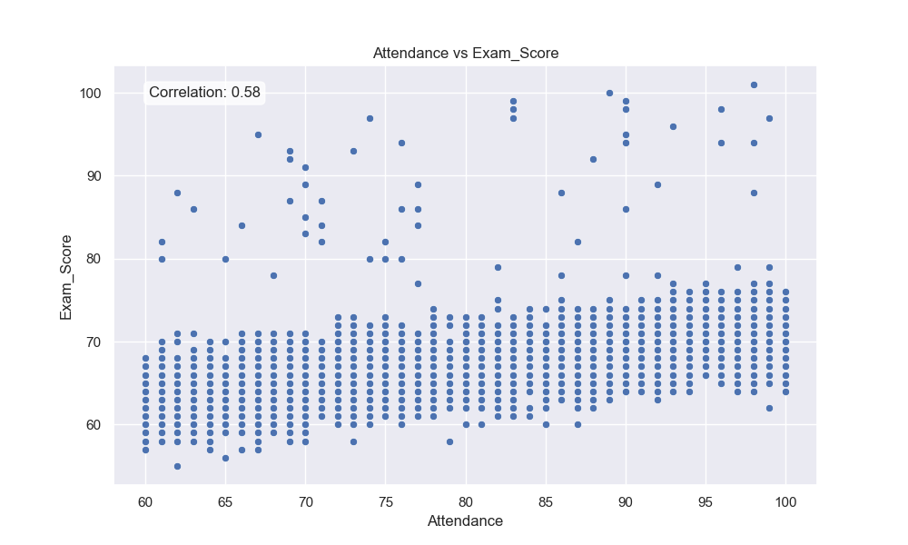
- **Analysis:** Scatter plot showing a strong positive correlation (0.60). Higher attendance strongly correlates with better scores.
- **Good:** Emphasizes the importance of attending classes.
- **Bad:** Some students with high attendance still score low, indicating additional barriers.

#### **14. Physical Activity vs. Exam Score (`Physical_Activity_vs_Exam_Score.png`)**
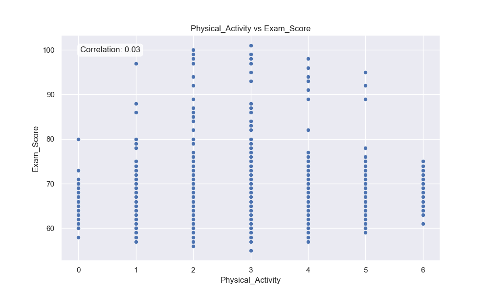
- **Analysis:** Scatter plot showing a very weak correlation (0.09). Physical activity has minimal direct impact on scores.
- **Good:** Suggests students can balance activity without academic detriment.
- **Bad:** Lack of strong correlation may overlook indirect benefits (e.g., stress reduction).

#### **15. Sleep Hours vs. Study Hours (`Sleep_Hours_vs_Hours_Studied.png`)**
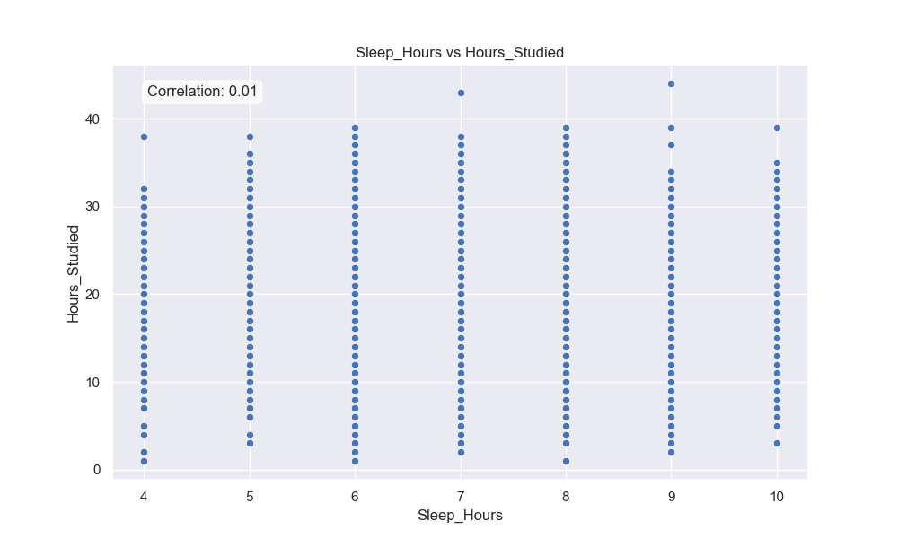
- **Analysis:** Scatter plot showing a very weak correlation (-0.02). Sleep and study hours are largely independent.
- **Good:** Students can prioritize sleep without significantly reducing study time.
- **Bad:** No clear trend makes it harder to draw actionable conclusions.

### Errors Detected

- **Missing Values:** Removed 0 rows with missing data during cleaning (dataset appears complete after initial inspection, 6,378 rows remain).
- **Unrealistic Values:** No negative values found in numerical columns after cleaning.
- **Duplicates:** No duplicate student IDs (not applicable as dataset lacks an ID column), but no duplicate rows detected.

### Test Coverage

The `test_analyze_student_performance.py` 

Run tests with:
```
coverage run --source=analyze_student_performance -m unittest discover
```
See coverage report with:
```
coverage report -m
```

```
Name                             Stmts   Miss  Cover   Missing
--------------------------------------------------------------
analyze_student_performance.py      96     18    91%   29-30, 129-164, 168
--------------------------------------------------------------
TOTAL                               96     18    91%

```
